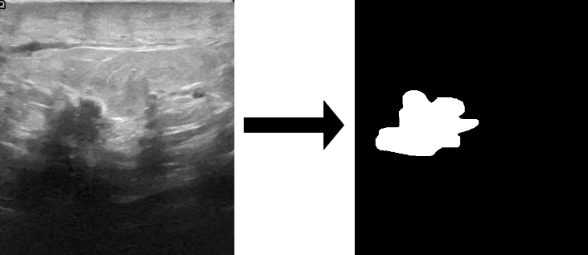
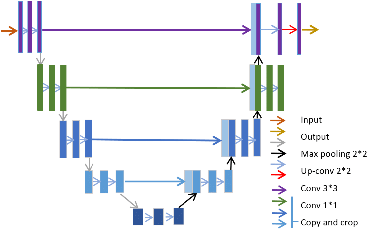
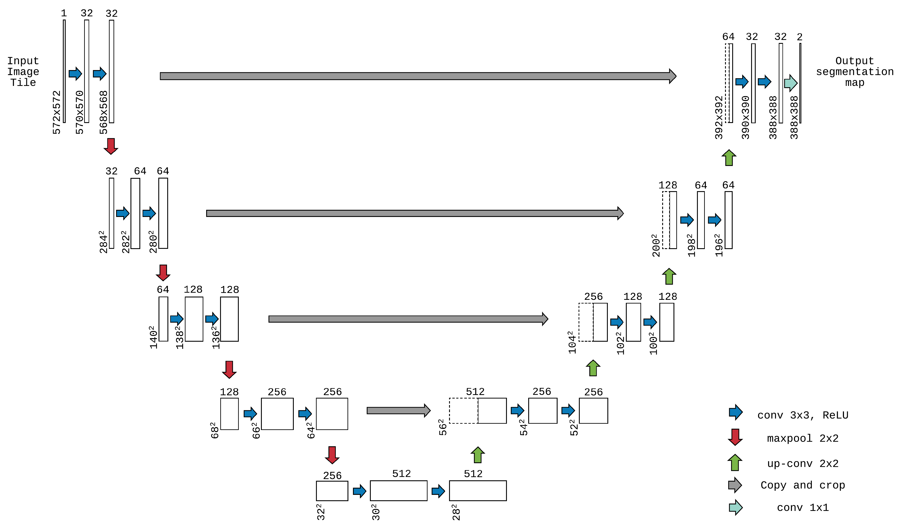

PYTORCH-IMAGE-SEGMENTATION
==========================

> **This is merely an experiment done on a few images and has not been validated/checked by external health organizations or doctors. No clinical studies have been performed based on the approach which can validate it. This model has been done as a P.O.C. and nothing can be concluded/inferred from this result.**

## Description

This project aims to implement biomedical image segmentation with the use of U-Net model to detect breast cancer. The below image briefly explains the output:

<p align="center">
    
</p>

<p align="center">
    
</p>


## Table of Content

- [Dataset](#dataset)

* [Preprocessing](#preprocessing)

* [Model](#model)

* [Loss function](#lossfunction)

<!-- * [Post-processing](#postprocessing) -->

* [Results](#results)

* [Dependency](#dependency)

* [References](#references)

# Dataset

Dataset can be downloaded from [Kaggle Breast Ultrasound Images Dataset](https://www.kaggle.com/aryashah2k/breast-ultrasound-images-dataset). 

[`dataloader`](src/dataloader.py#L10) expects a panda dataframe in format

|          **FILE**          |           **MASK**            | **LABEL** |
| :------------------------: | :---------------------------: | :-------: |
|  ./data/raw/normal/1.png   | ./data/raw/normal/1\_mask.png |  Normal   |
|  ./data/raw/normal/2.png   | ./data/raw/normal/2\_mask.png |  Normal   |
|  ./data/raw/benign/1.png   | ./data/raw/normal/1\_mask.png |  Benign   |
| ./data/raw/malignant/2.png | ./data/raw/normal/2\_mask.png | Malignant |
|            ...             |              ...              |    ...    |
|            ...             |              ...              |    ...    |


# Preprocessing

- Image resize to [224, 224] (gpu constraints)
- Flip
- Gaussian noise

# Model

Small modifications were made to the u-net model

- Input channel = 3
- Output classes = 1 (BinaryCrossEntropy)
- Input image size [224, 224]
- Init feature = 32 

<p align="center">
    
</p>

# Loss Function

[`loss function`](src/diceloss.py#L26) is based on dice coefficiant 


``` python
class BCEDiceLoss(nn.Module):
    def __init__(self):
        super().__init__()
        self.bce = nn.BCEWithLogitsLoss()
        self.dice = DiceLoss()

    def forward(
        self, logits: torch.Tensor, targets: torch.Tensor
    ) -> torch.Tensor:
        assert logits.shape == targets.shape
        dice_loss = self.dice(logits, targets)
        bce_loss = self.bce(logits, targets)

        return bce_loss + dice_loss
```

# Results

# Dependencies

1. Pytorch
2. PIL
3. Albumentations

# References

1. [UNet-segmentation-pytorch](https://github.com/rickyHong/UNet-segmentation-pytorch-repl#lossfunction)
2. [pytorch_resnet18_unet](https://github.com/usuyama/pytorch-unet/blob/master/pytorch_resnet18_unet.ipynb)
3. [aladdinpersson](https://github.com/aladdinpersson/Machine-Learning-Collection/tree/a2ee9271b5280be6994660c7982d0f44c67c3b63/ML/Pytorch/image_segmentation/semantic_segmentation_unet)